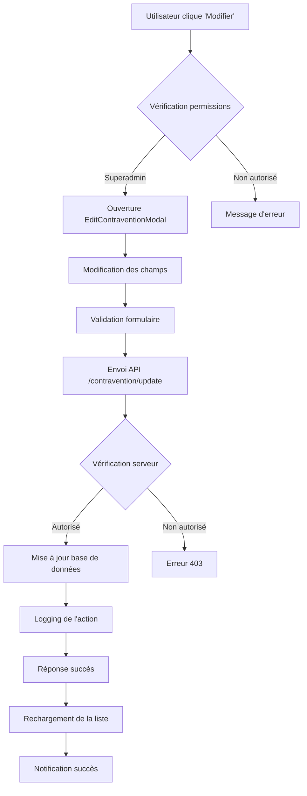

# Fonctionnalité de Modification des Contraventions (Superadmin)

## 📝 Vue d'ensemble

Nouvelle fonctionnalité permettant aux super-administrateurs de modifier toutes les données d'une contravention existante depuis les tables de consultation.

## 🔐 Permissions

- **Accès restreint** : Uniquement les utilisateurs avec le rôle `superadmin`
- **Vérification côté client** : AuthProvider vérifie le rôle avant d'afficher le bouton
- **Vérification côté serveur** : Endpoint API vérifie les permissions
- **Logging automatique** : Toutes les modifications sont enregistrées dans les logs

## 🎯 Fonctionnalités implémentées

### 1. **Modal de modification (`EditContraventionModal`)**

**Localisation** : `/lib/widgets/edit_contravention_modal.dart`

**Champs modifiables** :
- ✅ Date et heure de l'infraction
- ✅ Lieu (avec sélection sur carte)
- ✅ Type d'infraction
- ✅ Description
- ✅ Référence légale
- ✅ Montant de l'amende
- ✅ Statut de paiement (payée/non payée)
- ✅ Coordonnées géographiques (latitude/longitude)

**Fonctionnalités** :
- 🗺️ **Sélection sur carte** : Réutilise `LocationPickerDialog`
- ⚠️ **Avertissement** : Message d'information sur l'action superadmin
- ✅ **Validation** : Tous les champs requis sont validés
- 🔄 **Rechargement** : Actualise automatiquement la liste après modification

### 2. **Endpoint API (`/contravention/update`)**

**Localisation** : `/api/routes/index.php`

**Méthode** : `POST`

**Paramètres requis** :
```json
{
  "id": "123",
  "date_infraction": "2024-01-01T10:00:00",
  "lieu": "Avenue Mobutu, Lubumbashi",
  "type_infraction": "Excès de vitesse",
  "amende": "50000",
  "payed": "0",
  "latitude": "-11.6689",
  "longitude": "27.4794"
}
```

**Fonctionnalités** :
- 🔐 **Authentification** : Vérification des permissions superadmin
- 📝 **Validation** : Vérification des champs requis et de l'existence de la contravention
- 🔄 **Mise à jour** : Modification de tous les champs de la table `contraventions`
- 📊 **Détection des changements** : Compare les anciennes et nouvelles valeurs
- 📋 **Logging** : Enregistrement automatique des modifications

### 3. **Contrôleur backend (`ContraventionController::update`)**

**Localisation** : `/api/controllers/ContraventionController.php`

**Fonctionnalités** :
- ✅ **Validation de l'ID** : Vérification que la contravention existe
- 🗄️ **Auto-migration** : Ajout automatique des colonnes lat/lng si nécessaires
- 🔍 **Détection des changements** : Comparaison champ par champ
- 📝 **Mise à jour sécurisée** : Requête SQL préparée avec paramètres liés

### 4. **Interface utilisateur**

**Tables modifiées** :
- ✅ **Modal entreprise** (`entreprise_details_modal.dart`)
- ✅ **Modal particulier** (`particulier_details_modal.dart`)

**Nouvelle colonne** : "Modifier"
- 🎨 **Icône** : `Icons.edit` (orange)
- 🔒 **Tooltip** : "Modifier (Superadmin)"
- 🎯 **Action** : Ouvre `EditContraventionModal`

## 📊 Structure de la table des contraventions

| Colonne | Description | Actions disponibles |
|---------|-------------|-------------------|
| **ID** | Numéro de contravention | - |
| **Date** | Date de l'infraction | - |
| **Type** | Type d'infraction | - |
| **Lieu** | Lieu de l'infraction | - |
| **Amende** | Montant de l'amende | - |
| **Payé** | Statut de paiement | Toggle switch |
| **PDF** | Document PDF | Bouton voir PDF |
| **Carte** | Localisation GPS | Bouton voir carte |
| **Modifier** | **🆕 Modification** | **🔒 Bouton modifier (Superadmin)** |

## 🔄 Workflow de modification



## 📋 Logging des modifications

Chaque modification est automatiquement enregistrée avec :

```json
{
  "username": "superadmin",
  "action": "Modification contravention",
  "details": {
    "contravention_id": 123,
    "changes": {
      "lieu": {
        "old": "Avenue Test",
        "new": "Avenue Modifiée"
      },
      "amende": {
        "old": "50000",
        "new": "75000"
      }
    },
    "action_type": "update_contravention",
    "user_role": "superadmin"
  },
  "ip_address": "192.168.1.1",
  "user_agent": "Mozilla/5.0...",
  "timestamp": "2024-01-01 10:00:00"
}
```

## 🛡️ Sécurité

### Côté client (Flutter)
```dart
final authProvider = context.read<AuthProvider>();
if (!authProvider.isAuthenticated || authProvider.role != 'superadmin') {
  NotificationService.error(context, 'Accès refusé...');
  return;
}
```

### Côté serveur (PHP)
```php
// Vérification des permissions
$isSuperAdmin = true; // À remplacer par votre logique d'auth
if (!$isSuperAdmin) {
    http_response_code(403);
    echo json_encode(['success' => false, 'message' => 'Accès refusé...']);
    break;
}
```

## 🧪 Tests

### Test automatisé
```bash
php test_contravention_edit.php
```

### Test manuel
1. Se connecter en tant que superadmin
2. Aller dans une modal de détails (entreprise/particulier)
3. Cliquer sur l'onglet "Contraventions"
4. Cliquer sur le bouton orange "Modifier"
5. Modifier les champs et sauvegarder
6. Vérifier que les changements sont appliqués

## 🔧 Configuration requise

### Base de données
- ✅ Colonnes `latitude` et `longitude` (ajoutées automatiquement)
- ✅ Colonne `updated_at` (optionnelle)

### Permissions utilisateur
- ✅ Rôle `superadmin` requis
- ✅ Authentification active

### Dépendances Flutter
- ✅ `provider` : Gestion d'état
- ✅ `location_picker_dialog` : Sélection sur carte
- ✅ Widgets existants réutilisés

## 🚀 Déploiement

1. **Backend** : Déployer les fichiers API modifiés
2. **Frontend** : Compiler et déployer l'application Flutter
3. **Base de données** : Les migrations se font automatiquement
4. **Tests** : Exécuter les scripts de test

## 📈 Améliorations futures

- [ ] **Historique des modifications** : Table dédiée aux versions
- [ ] **Permissions granulaires** : Modification par champ
- [ ] **Validation avancée** : Règles métier spécifiques
- [ ] **Interface d'audit** : Écran de consultation des logs
- [ ] **Notifications** : Alertes en temps réel des modifications
